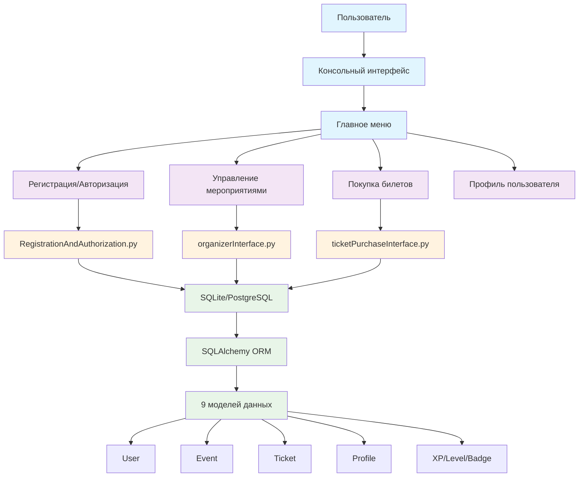
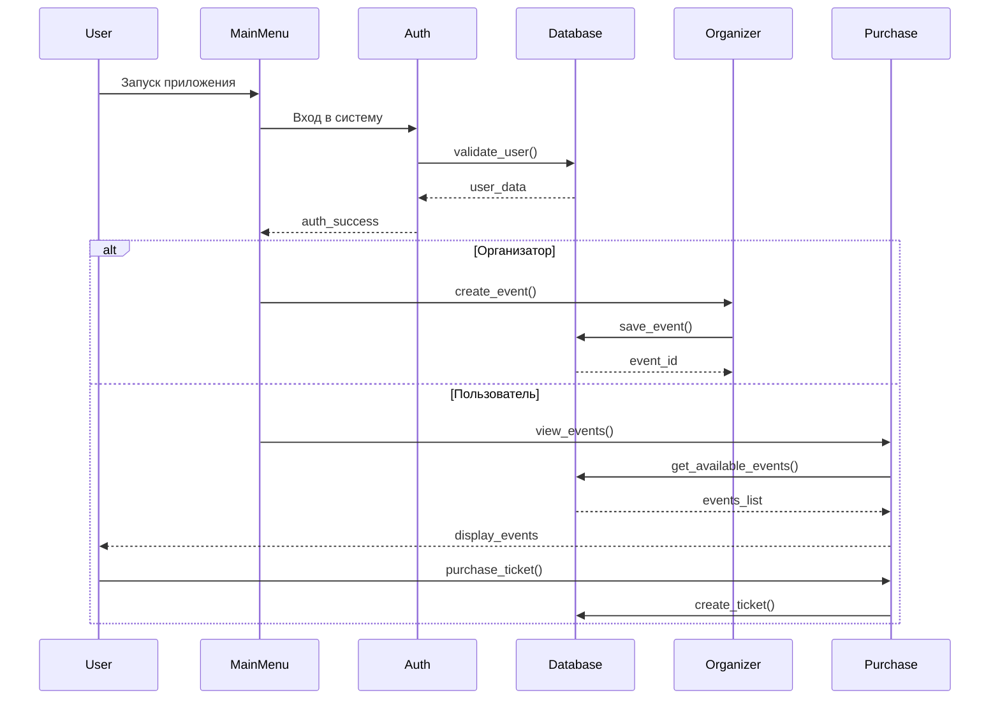
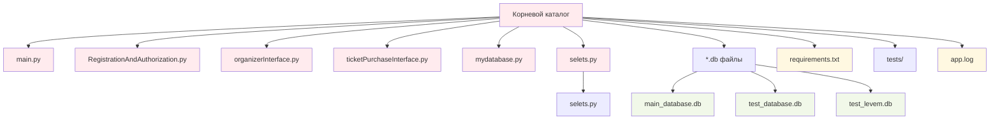
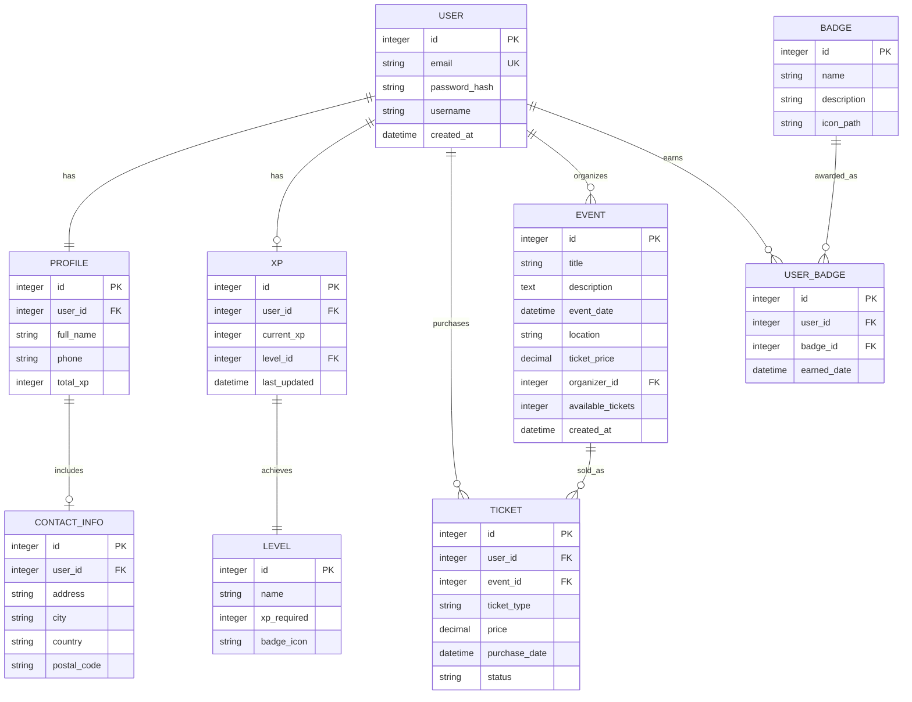

# Техническая документация Levem

## 1. Общая архитектура проекта

### 1.1 Диаграмма архитектуры (Модульная архитектура)



### 1.2 Описание слоёв

**Консольный интерфейс:**
- Взаимодействие с пользователем через командную строку
- Отображение меню и обработка пользовательского ввода
- Валидация и форматирование данных

**Модули бизнес-логики:**
- **RegistrationAndAuthorization.py** - регистрация и авторизация пользователей
- **organizerInterface.py** - управление мероприятиями для организаторов
- **ticketPurchaseInterface.py** - покупка билетов для пользователей

**Модели данных:**
- 9 SQLAlchemy моделей для работы с базой данных
- Описание структуры данных и связей между сущностями
- Обеспечение целостности данных

**База данных:**
- Поддержка SQLite и PostgreSQL
- Нормализованная схема с foreign key связями
- Транзакционная целостность

## 2. Компоненты приложения

### 2.1 Модули

**Регистрация и авторизация:**
- Регистрация новых пользователей с валидацией
- Авторизация существующих пользователей
- Хеширование паролей с помощью bcrypt
- Валидация email и сложности паролей

**Управление мероприятиями:**
- Создание мероприятий организаторами
- Редактирование и удаление мероприятий
- Просмотр списка мероприятий пользователями
- Управление доступностью билетов

**Покупка билетов:**
- Просмотр доступных мероприятий
- Покупка билетов пользователями
- Просмотр истории покупок
- Управление билетными операциями

**Система достижений:**
- Система опыта (XP) и уровней пользователей
- Значки и достижения
- Геймификация участия в мероприятиях

### 2.2 Взаимодействие компонентов



### 2.3 Структура каталогов



**Описание структуры:**

- `main.py` - точка входа в приложение, главное меню
- `RegistrationAndAuthorization.py` - модуль аутентификации
- `organizerInterface.py` - интерфейс управления мероприятиями
- `ticketPurchaseInterface.py` - интерфейс покупки билетов
- `mydatabase.py` - модели SQLAlchemy и работа с БД
- `selets.py` - утилита для выполнения SELECT запросов
- `*.db файлы` - файлы базы данных SQLite

## 3. Работа с данными

### 3.1 Модель базы данных



**Основные сущности:**

**USER:**
- `id` - уникальный идентификатор пользователя
- `email` - email пользователя (уникальный)
- `password_hash` - хешированный пароль bcrypt
- `username` - имя пользователя
- `created_at` - дата регистрации

**EVENT:**
- `id` - уникальный идентификатор мероприятия
- `title` - название мероприятия
- `description` - описание мероприятия
- `event_date` - дата проведения
- `location` - место проведения
- `ticket_price` - цена билета
- `organizer_id` - внешний ключ на организатора
- `available_tickets` - количество доступных билетов

**TICKET:**
- `id` - уникальный идентификатор билета
- `user_id` - внешний ключ на покупателя
- `event_id` - внешний ключ на мероприятие
- `ticket_type` - тип билета
- `price` - цена билета
- `purchase_date` - дата покупки
- `status` - статус билета

### 3.2 Примеры работы с данными

**Регистрация пользователя:**
```python
{
    "email": "user@example.com",
    "password": "securepassword123",
    "username": "john_doe",
    "full_name": "John Doe"
}
```

**Создание мероприятия:**
```python
{
    "title": "Техническая конференция 2024",
    "description": "Ежегодная конференция для IT специалистов",
    "event_date": "2024-12-15T14:00:00",
    "location": "Конференц-зал 'Технопарк'",
    "ticket_price": 1500.00,
    "available_tickets": 100
}
```

**Структура ответа при получении мероприятия:**
```python
{
    "id": 1,
    "title": "Техническая конференция 2024",
    "description": "Ежегодная конференция для IT специалистов",
    "event_date": "2024-12-15T14:00:00",
    "location": "Конференц-зал 'Технопарк'",
    "ticket_price": 1500.00,
    "available_tickets": 85,
    "organizer": {
        "id": 2,
        "username": "event_org",
        "email": "org@example.com"
    },
    "created_at": "2024-01-01T10:00:00"
}
```

### 3.3 Форматы данных

- Все данные хранятся в **реляционной структуре** (таблицы)
- Используется **SQLAlchemy ORM** для работы с данными
- Поддерживаются **SQLite** и **PostgreSQL**
- Пароли хешируются с помощью **bcrypt**
- Даты в формате **datetime Python**
- Валютные значения в формате **Decimal**

## 4. Валидация и обработка ошибок

### 4.1 Валидация

**Инструмент:** Встроенная валидация Python с использованием регулярных выражений и проверки типов данных.

**Реализация:** Валидация реализована в каждом модуле с проверкой:
- Корректности email через регулярные выражения
- Сложности паролей (минимум требований)
- Типов входных данных
- Обязательных полей

**Ответ при ошибке валидации:** При ошибке валидации возвращается информативное сообщение об ошибке:
```python
{
    "error": "Некорректный формат email",
    "field": "email"
}
```

### 4.2 Обработка ошибок

**Централизованная обработка:** Обработка ошибок реализована в каждом модуле с try-except блоками.

**Типы ошибок:**
- `ValueError` - некорректные входные данные
- `IntegrityError` - нарушение целостности базы данных  
- `DatabaseError` - ошибки работы с базой данных
- `AuthenticationError` - ошибки авторизации

**Формат ошибок:**
```python
{
    "error_type": "DatabaseError",
    "message": "Ошибка при сохранении данных",
    "details": "Duplicate entry for email"
}
```

## 5. Используемые технологии и библиотеки

| Технология | Назначение |
|------------|------------|
| **Python 3.8+** | Основной язык программирования |
| **SQLAlchemy 1.4.46** | ORM для работы с базой данных |
| **SQLite/PostgreSQL** | Системы управления базами данных |
| **bcrypt 3.2.2** | Хеширование паролей |
| **psycopg2** | Драйвер для подключения к PostgreSQL |
| **alembic 1.11.1** | Управление миграциями базы данных |
| **pytest 7.4.0** | Фреймворк для модульного тестирования |
| **re (Regex)** | Валидация email и других данных |

**Архитектурные решения:**

**Консольное приложение:**
- Прямое взаимодействие с пользователем через командную строку
- Меню-ориентированный интерфейс
- Обработка пользовательского ввода

**Модульная архитектура:**
- Четкое разделение ответственности между модулями
- Простота тестирования и поддержки
- Возможность расширения функционала

**Геймификация:**
- Система опыта и уровней для мотивации пользователей
- Значки и достижения
- Вовлечение через игровые механики

---

*Документация создана для проекта Levem - консольного приложения для управления мероприятиями и продажи билетов с системой достижений.*
